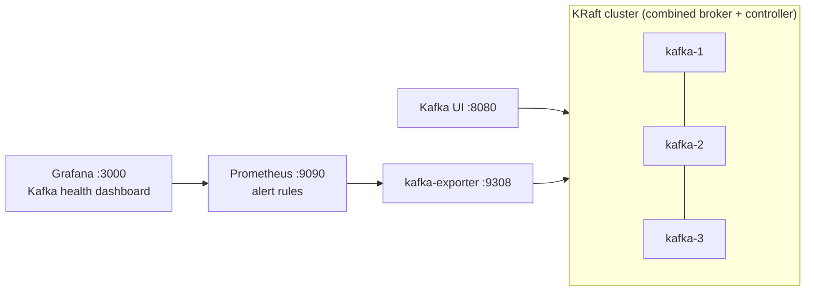

# Lab 01 · Kafka platform and broker-loss drill

A 3-broker KRaft cluster configured the way I'd want a production cluster to behave, plus the monitoring I set up first on any cluster I review.



## Run

```bash
docker compose up -d --wait        # about 1 minute
./scripts/failure-drill.sh         # about 1-2 minutes
docker compose down -v
```

| URL | What |
|---|---|
| http://localhost:8080 | Kafka UI: topics, partitions, ISR, consumer groups |
| http://localhost:3000 | Grafana (anonymous viewer), dashboard *Kafka labs → Kafka health* |
| http://localhost:9090/alerts | Prometheus alert rules; watch them fire during the drill |

Clients on your machine can bootstrap from `localhost:9092,localhost:9094,localhost:9096`.

## What the drill does

1. **Creates two topics.**
   - `payments`: RF=3, `min.insync.replicas=2`.
   - `payments-strict`: RF=3, `min.insync.replicas=3`.
2. **Writes a baseline.** 1,000 records go to `payments` with `acks=all`.
3. **Stops `kafka-3`.** The partitions it hosted become under-replicated.
4. **Writes 1,000 more records to `payments`.** They succeed, because 2 in-sync replicas are enough.
5. **Writes to `payments-strict`.** It is rejected with `NotEnoughReplicasException`. This is the rolling-upgrade outage waiting to happen.
6. **Counts the records.** All 2,000 acknowledged records are there.
7. **Restarts `kafka-3`.** The ISR recovers and under-replicated partitions return to 0.

The script exits non-zero if any step behaves differently, and CI runs it on every push.

## Settings that matter here

| Setting | Value | Why |
|---|---|---|
| `default.replication.factor` | 3 | Survive one broker loss while leaving room for maintenance |
| `min.insync.replicas` | 2 | `acks=all` means "on at least 2 brokers", not "on the leader" |
| `unclean.leader.election.enable` | false | An out-of-sync replica must never become leader silently |
| `auto.create.topics.enable` | false | A typo in a producer shouldn't create an RF=1 topic |
| `offsets.topic.replication.factor` | 3 | Committed offsets survive a broker loss |

## Alerts (prometheus/alerts.yml)

- `KafkaBrokerMissing`: fewer brokers than expected.
- `KafkaUnderReplicatedPartitions`: the early warning.
- `KafkaPartitionAtMinIsr`: one more failure and `acks=all` writes stop.
- `KafkaConsumerLagGrowing`: lag is high **and** still rising, which avoids paging on a batch job that is catching up.

## Production notes

- **Split controllers from brokers.** Use 3 dedicated controllers, and spread brokers across zones with `broker.rack` so replicas land in different zones.
- **Add broker JMX metrics.** Watch request latency, request handler idle %, log flush time and JVM GC. kafka-exporter only sees what the admin API sees.
- **Secure the listeners.** TLS plus SASL (SCRAM or OAUTHBEARER), with ACLs per service principal.
- **On Kubernetes, let Strimzi do this.** It generates the same settings from a `Kafka` custom resource and rolls brokers one at a time while checking ISR. That only works when `min.insync.replicas < RF`.
