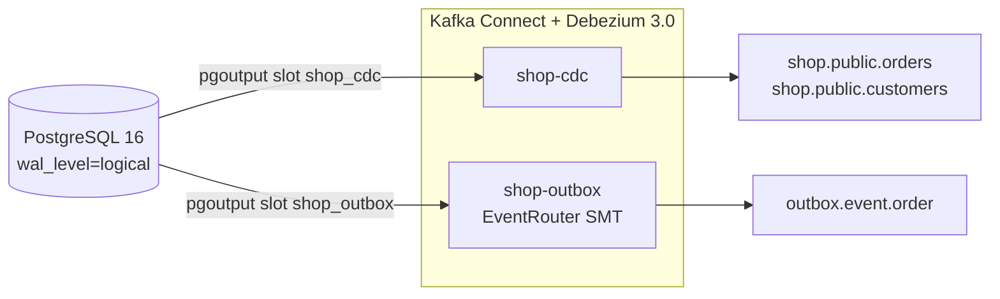

# Lab 02 · Debezium CDC from PostgreSQL, plus the transactional outbox

Two connectors on one database:

- **`shop-cdc`** streams row changes from `customers` and `orders`, with before and after images.
- **`shop-outbox`** turns rows written to an `outbox` table into clean domain events. It uses Debezium's `EventRouter`.



## Run

```bash
docker compose up -d --wait          # Kafka, PostgreSQL, Kafka Connect, Kafka UI
./scripts/register-connectors.sh     # PUT both configs, wait for RUNNING
./scripts/cdc-demo.sh                # about 2 minutes
docker compose down -v
```

To explore, open Kafka UI at http://localhost:8080 (topics and connectors), or connect to PostgreSQL at `localhost:5432` (user, password and database are all `shop`).

## What the demo checks

1. **Snapshot.** Existing rows arrive as `op=r`.
2. **Insert, update, delete.** They arrive as `op=c`, `u` and `d`.
   - Updates carry the `before` image, because the table uses `REPLICA IDENTITY FULL`.
   - A delete also emits a tombstone, so compacted topics drop the key.
3. **Outbox.** The order row and an `OrderPaid` event are committed in one transaction. Consumers get an event where:
   - the key is the order id, so each order's events stay in order;
   - the `eventType` header says what happened;
   - the value is only the JSON payload.

   There is no dual write and no race between the database and Kafka.
4. **Outage drill.** Kafka Connect is stopped while 50 orders are written.
   - The replication slot holds the WAL, and the script prints how much.
   - When Connect comes back, all 50 changes arrive. Nothing is lost.

## Production notes

These are the points I look at in a CDC review:

- **Replication slot lag is the metric that pages.** A stopped connector keeps its slot, and PostgreSQL keeps WAL until the disk fills. Alert on `pg_wal_lsn_diff(pg_current_wal_lsn(), confirmed_flush_lsn)`. On PostgreSQL 13+, set `max_slot_wal_keep_size` as a safety cap.
- **Quiet tables cause slot lag too.** `heartbeat.interval.ms` makes the connector confirm its position when the captured tables are idle but the rest of the database is busy.
- **`REPLICA IDENTITY FULL` has a cost.** It writes more WAL on every update. Use it only where consumers need the old values.
- **Pick the snapshot mode deliberately.** Use `initial` for a new pipeline and `no_data` when history already lives elsewhere. For a big table, plan an incremental snapshot (signal table) rather than a blocking one.
- **Plan for schema changes.** Adding a nullable column is safe. Renames and type changes need a rollout plan for consumers. With Avro or Protobuf plus a schema registry, set compatibility per subject.
- **Publications.** Let Debezium manage a `filtered` publication, or have your DBA create it once. Don't let every connector create `FOR ALL TABLES`.
- **Delivery is at-least-once.** Consumers must be idempotent. Key on the primary key and use `source.lsn` to drop duplicates.
