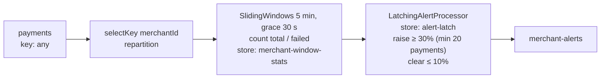

# Lab 03 · Kafka Streams: sliding-window alerting with a latch

**The question:** *is any merchant's payment failure rate above 30% over the last 5 minutes?*

**The answer this lab gives:** one `RAISED` event when that starts and one `CLEARED` event when it ends. Not one alert per payment.



## Run

```bash
mvn -f app/pom.xml verify              # 9 TopologyTestDriver tests, no Kafka needed
docker compose up -d --build           # Kafka + the Streams app (built in Docker)
./scripts/run-demo.sh                  # 14 simulated minutes of payments, one incident
docker compose down -v
```

The generator uses **simulated event time**: 14 minutes of traffic are produced in seconds. The app windows on each payment's own timestamp, so the result is the same as it would be live.

Expected output:

```
RAISED   merchant-3  window ending ...  ~90/300 failed (30%)
CLEARED  merchant-3  window ending ...  ~29/300 failed (10%)
```

## Design choices worth defending

- **Sliding windows, not tumbling.** A tumbling 5-minute window can split an incident across two windows and miss it. A sliding window evaluates "the last 5 minutes" at every event.
- **Only the trailing window decides.** A sliding aggregation also updates look-ahead windows that end in the future. The processor skips any window ending after stream time, and any window older than the one it last evaluated for that merchant.
- **The latch lives in a state store.** It is backed by a changelog topic, so after a restart or rebalance the app remembers which merchants are already alerting. That means no duplicate pages.
- **Hysteresis.** The alert raises at 30% and clears at 10%, so a rate hovering around 30% doesn't flap.
- **Minimum volume.** 3 failures out of 3 payments is not an incident.
- **Event time plus grace.** Late events inside 30 seconds still count (see the `lateEventWithinGraceIsCounted` test). Replaying a day of data gives the same alerts as live traffic.
- **`exactly_once_v2`.** Window counts and alerts are committed atomically with the input offsets.

## Tests (app/src/test)

| Test | Checks |
|---|---|
| `raisesOnceWhenFailureRateCrossesThreshold` | 8/20 failed raises exactly one alert with the right counts |
| `doesNotRepeatWhileAlreadyRaised` | More failures don't re-raise |
| `clearsOnceWhenRateRecovers` | Failures age out of the window, so the alert clears once |
| `hysteresisPreventsFlapping` | 27% (between clear and raise) keeps the alert raised |
| `ignoresHighRateOnLowVolume` | 10/10 failed but below minimum volume, so no alert |
| `windowEndIsInclusive` / `oneMillisecondPastTheWindowDoesNotCount` | Exact window boundary behaviour |
| `merchantsAreIndependent` | Per-key isolation |
| `lateEventWithinGraceIsCounted` | An out-of-order event updates the current window |

## Production notes

- **Caching.** Record caching is disabled here so every update is visible in the demo. In production, keep the cache on and consider `suppress` or emit-final semantics if you only need closed windows.
- **Store size.** The window store keeps (window + grace) of data per merchant. Watch RocksDB memory, and set `rocksdb.config.setter` on large keyspaces.
- **Standby replicas.** Set `num.standby.replicas=1` so a failover doesn't have to rebuild state from the changelog.
- **Unhealthy thread signals.** Alert on the `StreamThread` being replaced and on rebalances in a loop. Both usually mean a poison record or a slow external call inside the topology.
